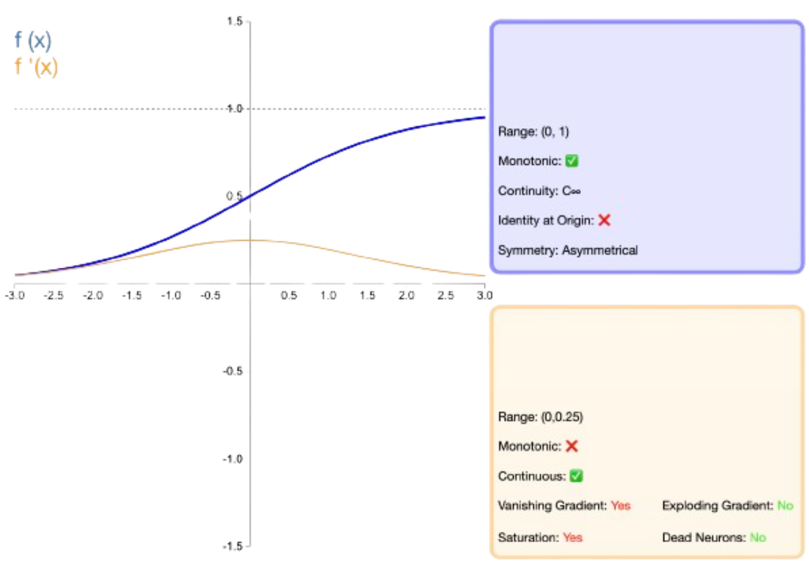
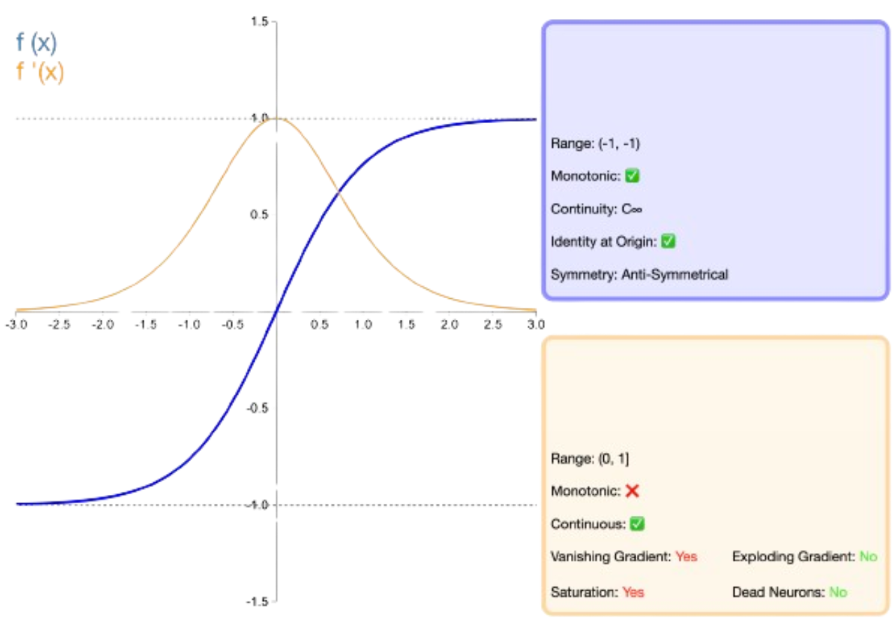
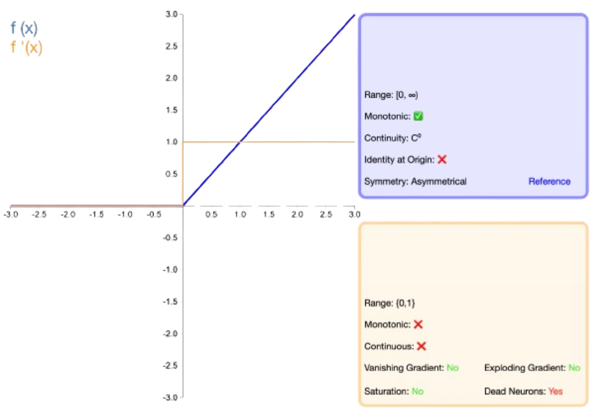
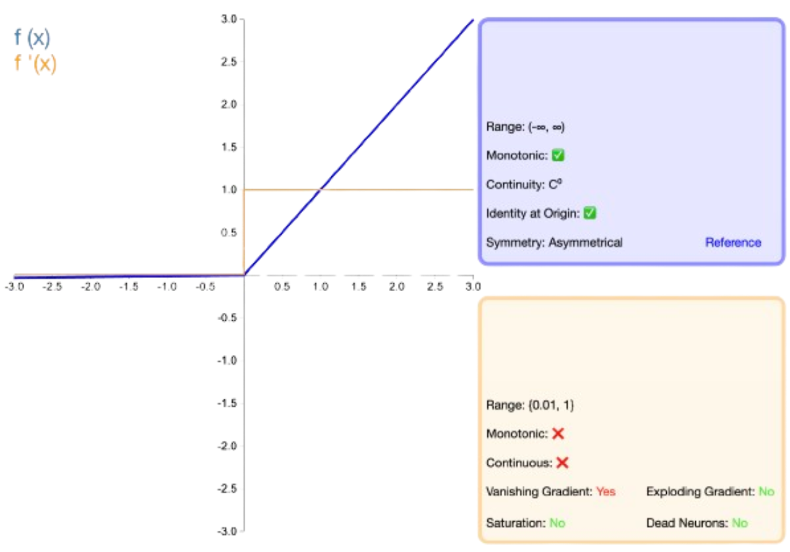
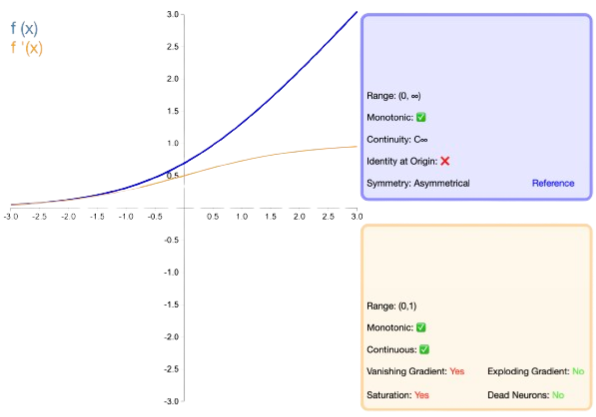

### 1. Gradient Descent

#### Introduction
- **Gradient Descent** is an optimization algorithm used to estimate parameters in various statistical and machine learning models.
- It can optimize a wide range of functions, including linear regression, logistic regression, and clustering algorithms like t-SNE.

#### Basics of Gradient Descent
- **Assumptions**: Understanding of least squares and linear regression is necessary.
- **Optimization in Data Science**: Many algorithms involve optimizing parameters, such as intercepts, slopes, and complex functions.
- **Gradient Descent's Role**: It can optimize these parameters efficiently.

#### Steps in Gradient Descent
1. **Define the Loss Function**:
   - Use the sum of the squared residuals (SSR) to evaluate how well a line fits the data.
   - In machine learning, SSR is a type of Loss Function.

2. **Calculate the Derivative**:
   - Take the derivative of the loss function with respect to the parameters (intercept and slope).
   - This derivative helps in understanding the slope of the loss function at any given point.

3. **Initialize Parameters**:
   - Start with random values for the parameters (e.g., intercept = 0, slope = 0.64).

4. **Compute the Step Size**:
   - Use the derivative to determine the direction and magnitude of the step.
   - Step size is calculated by multiplying the derivative by a learning rate.

5. **Update Parameters**:
   - New parameters are calculated by subtracting the step size from the current parameter values.
   - Repeat the process until the step size is very small or a maximum number of iterations is reached.

#### Practical Considerations
- **Learning Rate**:
  - Determines the size of the steps taken in each iteration.
  - Too high a learning rate can cause the algorithm to overshoot the optimal solution.
  - Too low a learning rate can make the algorithm converge slowly.

- **Stopping Criteria**:
  - Gradient Descent stops when the step size is close to zero (typically < 0.001).
  - Alternatively, it stops after a predefined maximum number of iterations (e.g., 1000 steps).

#### Advanced Variants
- **Stochastic Gradient Descent (SGD)**:
  - Uses a random subset of the data at each iteration to reduce computation time.
  - Suitable for large datasets.

#### Summary
- **Gradient Descent** is a powerful algorithm for optimizing parameters in various models.
- It involves initializing parameters, calculating derivatives, determining step sizes, and updating parameters iteratively.
- Proper tuning of the learning rate and understanding of stopping criteria are crucial for effective implementation.
- Variants like Stochastic Gradient Descent address computational efficiency for large datasets.

#### Further Reading
- **Loss Functions**: Explore different types of loss functions beyond SSR.
- **Learning Rate Schedules**: Techniques to dynamically adjust the learning rate during training.
- **Convergence Analysis**: Mathematical insights into why and how Gradient Descent converges to optimal solutions.

By understanding and applying Gradient Descent, one can efficiently estimate parameters in a wide range of statistical and machine learning models.

Resources:
- [Gradient Descent StatQuest](https://youtu.be/sDv4f4s2SB8?si=qP6GN1Hi9Jif0q6_)

---

### 2. Backpropagation

#### Introduction to Backpropagation
- **Backpropagation** is a method used to optimize the weights and biases in neural networks.
- the main ideas of backpropagation: <mark>using the chain rule to calculate derivatives and applying gradient descent to optimize parameters.</mark>

**Note:**
- We know that Neural networks transform input data through layers of nodes, using activation functions, weights, and biases.
- The loss function measures how "wrong" our model's predictions are.
  - Parameters are the knobs we adjust in our model (weights, biases).
  - We want to adjust these parameters to minimize the loss (make our model less wrong).
  - To do this, we need to know how each parameter influences the loss.
  - The chain rule of calculus helps us break this down into smaller steps.

#### Main Ideas of Backpropagation
1. **Using the Chain Rule to Calculate Derivatives**:
   - The chain rule is essential for calculating the derivative of the loss function with respect to each parameter.
   - To find how a change in a parameter (like bias) affects the loss, we multiply two things:
     - How much a change in the parameter affects the predicted values.
     - How much a change in the predicted values affects the loss.
     

1. **Applying Gradient Descent to Optimize Parameters**:
   - Gradient descent is used to find the optimal values for the parameters by iteratively adjusting them based on the calculated derivatives.
   - The process starts with initializing the parameters (e.g., setting \( b3 \) to 0) and then iteratively updating them to minimize the loss function (sum of the squared residuals).

#### Detailed Steps
1. **Initialization**:
   - Start with random or zero values for the parameters (parameters refers to the Weights & baises).

2. **Forward Pass**:
   - Compute the predicted values by passing the input data through the neural network.
   - The final output is compared to the desired output (ground truth) to calculate the loss function.

3. **Backward Pass (Chain Rule Application)**:
   - Calculate the derivative of the loss function with respect to the predicted values.
   - Calculate the derivative of the predicted values with respect to the parameter (e.g., \( b3 \)).
   - Combine these derivatives using the chain rule to get the derivative of the loss function with respect to the parameter.

4. **Gradient Descent Update**:
   - Use the derivative to compute the step size.
   - Update the parameter by subtracting the step size from the current value.
   - Repeat the process until the step size is very small or a maximum number of iterations is reached.

#### Practical Considerations
- **Learning Rate**: Determines the size of the steps in gradient descent. Too high can cause overshooting, too low can slow convergence.
- **Convergence Criteria**: Stop when the step size is very small or after a predefined number of iterations.

#### Summary
- **Backpropagation** is a powerful method for optimizing neural network parameters.
- It involves using the chain rule to calculate derivatives and applying gradient descent to iteratively update parameters.
- Proper initialization, forward and backward passes, and careful tuning of the learning rate are crucial for effective implementation.

#### Further Reading
- **Chain Rule**: Deeper understanding of how it applies to complex functions.
- **Gradient Descent Variants**: Stochastic Gradient Descent, Mini-batch Gradient Descent.
- **Activation Functions**: Impact on backpropagation and network performance.

By understanding and applying backpropagation, one can efficiently train neural networks to make accurate predictions on complex datasets.

Resources:
- [Backpropagation via StatQuest](https://youtu.be/IN2XmBhILt4?si=_Zp0Q7ka8tYxWIJ5)
- [Visualizing BP](https://hmkcode.com/ai/backpropagation-step-by-step/)
- [Backpropagation 3B1B](https://www.youtube.com/watch?v=Ilg3gGewQ5U)

---

### Learning Rate (α)

* **Definition:** The learning rate is a scalar value, usually small and positive (e.g., 0.01, 0.001), that controls the step size in the parameter update during training. It determines how much the weights and biases are adjusted based on the calculated gradient of the loss function.

* **Role in Optimization:**
    * **Gradient Descent:** Learning rate scales the gradient to determine how much to move the parameters in the direction that reduces the loss.
    * **Stochastic Gradient Descent (SGD):**  The same principle applies, but updates are made after each training example or mini-batch, introducing randomness and potentially faster convergence.
    * **Other Optimizers (Adam, RMSprop, etc.):** These optimizers adapt the learning rate for each parameter based on historical gradients, often leading to more efficient training.

* **Impact on Training:**

| Learning Rate | Pros                                         | Cons                                         |
|---------------|----------------------------------------------|----------------------------------------------|
| Small         | More precise updates                         | Slow convergence                             |
|               | Less likely to overshoot the optimal solution | Risk of getting stuck in local minima        |
| Large         | Faster initial progress                       | Can overshoot the optimal solution           |
|               | Potential to escape shallow local minima     | Leading to instability and oscillations      |

* **Learning Rate Schedules:**  

    * **Constant Learning Rate:** The simplest approach, but can be suboptimal as the model gets closer to convergence.
    * **Decaying Learning Rate:** Gradually decreases the learning rate over time. This allows for larger steps initially and finer adjustments later in training.
        * **Types:** Time-based decay, step decay, exponential decay.
    * **Cyclical Learning Rate:**  Alternates between high and low learning rates during training. Can help escape saddle points and sharp minima.
    * **Adaptive Learning Rates:** Algorithms like Adam, RMSprop, and Adagrad automatically adjust the learning rate for each parameter based on past gradients.

* **Choosing the Right Learning Rate:**

    * **Hyperparameter Tuning:** Experiment with different learning rates and schedules to find what works best for specific model and data.
    * **Learning Rate Finder:** Start with a very small learning rate and gradually increase it until the loss starts to diverge.  This gives an idea of the optimal range, rather than starting too high and risking instability.

* **Additional Considerations:**
  * **Batch Size**
    * **Larger batch sizes can allow for higher learning rates due to less noisy gradient estimates.**

    - **Gradient Estimates:** When training a model, the gradient of the loss function with respect to the model parameters is computed. This gradient indicates the direction and magnitude of change needed to update the parameters to minimize the loss.
    - **Noise in Gradients:** With smaller batch sizes, the gradient estimates can be noisy because they are based on a smaller subset of the data. This noise can cause erratic updates to the model parameters.
    - **Larger Batches:** Larger batch sizes provide a more accurate estimate of the true gradient since they are computed over a larger portion of the dataset. This reduced noise allows for more confident updates, which in turn can support higher learning rates without causing the model to diverge.

  * **Data Normalization**
    * **Normalized data can help stabilize training and allow for higher learning rates.**
    * **Stabilizing Training:** Data normalization, such as mean subtraction and variance scaling (e.g., using techniques like Z-score normalization or min-max scaling), ensures that the input features have similar scales. This prevents features with larger magnitudes from dominating the learning process.
    * **Higher Learning Rates:** When data is normalized, the gradients are more consistent across different features, which makes it safer to use higher learning rates. Without normalization, large gradients from unnormalized features could cause the model to diverge if the learning rate is too high.

  * **Model Architecture**
    * **Deeper models may require smaller learning rates due to the vanishing gradient problem.**
    * **Deeper Models:** Deeper neural networks (i.e., networks with more layers) are more prone to the vanishing gradient problem. This issue occurs because the gradient signal becomes exponentially smaller as it propagates backward through the layers, making it difficult for the earlier layers to learn.
    * **Vanishing Gradient Problem:** To mitigate the vanishing gradient problem, smaller learning rates are often used. This ensures that the updates to the parameters are small and stable, preventing the model from diverging due to overly aggressive updates.
    * **Alternatives:** Techniques such as residual connections (e.g., ResNet), layer normalization, and the use of activation functions like ReLU (Rectified Linear Unit) can also help alleviate the vanishing gradient problem and potentially allow for higher learning rates.

#### Adaptive learning rate algorithms 
They have evolved over time to address the challenges of training complex models, especially in deep learning. Here's a list of these algorithms from the basic to the more advanced, along with a brief description of each:

Here’s a tabular exhaustive comparison of various optimization algorithms used in machine learning, categorized into Basic, Intermediate, and Advanced levels:
Absolutely! Here's the table split into three parts with an added "More Information" column:

**Basic Learning Rate Algorithms**

| **Algorithm**                | **Description**                                                                                                                                                   | **Advantages**                                                                                                    | **Disadvantages**                                                                                                      | **More Information** |
|:------------------------------|:-----------------------------------------------------------------------------------------------------------------------------------------------------------------|:----------------------------------------------------------------------------------------------------------------|:-------------------------------------------------------------------------------------------------------------------|:----------------------|
| **SGD**                       | Updates parameters for each training example.   **LR**: *Fixed throughout the training process.*                                                                                                 | Simple and easy to implement,                                                                                     | High variance in updates can lead to slow convergence.                                                                 | Introduces randomness into the optimization process. Noisy updates, can oscillate around the optimum. |
| **Mini-Batch GD**            | Updates parameters for a mini-batch of training examples.   **LR**: *Fixed, but can be adjusted dynamically.*                                                                                                 | Reduces variance and can utilize vectorized operations for efficiency.                                             | Requires selection of appropriate batch size.                                                                          | Less noisy updates than SGD, more computationally efficient. |

**Intermediate Learning Rate Algorithms**

| **Algorithm**                | **Description**                                                                                                                                                   | **Advantages**                                                                                                    | **Disadvantages**                                                                                                      | **More Information**                                      |
|:------------------------------|:-----------------------------------------------------------------------------------------------------------------------------------------------------------------|:----------------------------------------------------------------------------------------------------------------|:-------------------------------------------------------------------------------------------------------------------|:-----------------------------------------------------------|
| **Momentum**                 | Accelerates SGD by considering the previous update’s direction and velocity.   **Parameters**:Learning rate (α), Momentum term (γ).                                                                                       | Helps escape local minima and smoothens updates.                                                                   | Introduces an additional hyperparameter (momentum term).                                                               | Builds inertia to speed up convergence in relevant directions. |
| **NAG**                      | Similar to Momentum but performs a lookahead before updating parameters.   **Parameters**: Learning rate (α), Momentum term (γ).                                                                                         | More accurate and often faster convergence than standard Momentum.                                                 | More complex implementation and introduces additional computational overhead.                                           | Variant of momentum with improved responsiveness to the gradient. |

**Advanced Learning Rate Algorithms**

| **Algorithm**                | **Description**                                                                                                                                                   | **Advantages**                                                                                                    | **Disadvantages**                                                                                                      | **More Information**                                                                                      |
|:------------------------------|:-----------------------------------------------------------------------------------------------------------------------------------------------------------------|:----------------------------------------------------------------------------------------------------------------|:-------------------------------------------------------------------------------------------------------------------|:----------------------------------------------------------------------------------------------------------|
| **Adagrad**                  | Adaptively adjusts learning rates for each parameter, performing larger updates for infrequent features and smaller updates for frequent features.  **Parameters**:  Learning rate (α), Epsilon (ε).                 | No need to manually tune the learning rate and handles sparse data well.                                           | Learning rate can become very small over time, leading to premature convergence.                                        |  Per-parameter learning rates that decay as training progresses. |
| **Adadelta**                 | An extension of Adagrad that seeks to reduce Adagrad’s aggressive, monotonically decreasing learning rate problem by limiting the accumulated past gradients.   **Parameters**: Decay rate (ρ), Epsilon (ε).     | Robust to large gradients and no need to set a learning rate.                                                      | Can be computationally expensive and still requires careful hyperparameter tuning.                                      | Adapts learning rates based on a window of recent gradients. |
| **RMSprop**                  | Modifies Adagrad to resolve its diminishing learning rate problem by using a moving average of squared gradients to normalize the gradient.    **Parameters**:  Learning rate (α), Decay rate (γ), Epsilon (ε)                     | Works well in practice and is suitable for non-stationary objectives.                                              | Requires careful tuning of hyperparameters.                                                                            |  Adapts learning rate for each parameter based on recent magnitudes of gradients. |
| **Adam**                      | Combines the advantages of both RMSprop and Momentum by maintaining a moving average of both the gradients and their squares.    **Parameters**:  Learning rate (α), Beta1 (β1), Beta2 (β2), Epsilon (ε).                                     | Well-suited for large datasets and high-dimensional parameter spaces; less sensitive to hyperparameter tuning.     | Can be computationally expensive and sometimes converge to suboptimal solutions.                                        | Combines adaptive learning rates with momentum.              |
| **Adamax**                   | A variant of Adam based on the infinity norm, which has better performance on certain tasks.     **Parameters**: Learning rate (α), Beta1 (β1), Beta2 (β2), Epsilon (ε).                                                                   | Handles large gradients and outliers better than Adam.                                                             | Similar computational overhead as Adam and requires hyperparameter tuning.                                              | A variant of Adam based on the infinity norm.                |
| **Nadam**                    | Combines Adam with Nesterov Accelerated Gradient for improved performance.   **Parameters**:Learning rate (α), Beta1 (β1), Beta2 (β2), Epsilon (ε).                                                                                         | Often leads to faster convergence and better performance than Adam.                                                | Increased complexity and computational overhead due to Nesterov's lookahead step.                                        |  Combines adaptive learning rates with Nesterov momentum. |
                                      

#### Summary:
- **Basic Algorithms** like SGD and Mini-Batch Gradient Descent are simple and easy to implement but can suffer from slow convergence and high variance.
- **Intermediate Algorithms** like Momentum and Nesterov Accelerated Gradient introduce the concept of velocity to smooth updates and can escape local minima more effectively.
- **Advanced Algorithms** like Adagrad, Adadelta, RMSprop, Adam, Adamax, and Nadam adapt the learning rates dynamically based on past gradients, often leading to faster and more reliable convergence, though they come with increased computational complexity and the need for careful hyperparameter tuning.

---
### Activation Functions
Activation functions are crucial components in neural networks that determine the output of a neuron based on its input. They introduce non-linearity into the model, enabling the network to learn complex patterns. Here’s an overview of various activation functions, their properties, characteristics, and when to use each.

**1. Linear Activation Function**

* **Description:**
    - Mathematical form: `f(x) = x`
    - Straight line relationship between input and output.
* **Use Cases:**
    - Output layer for regression tasks (predicting continuous values).
* **Limitations:**
    - No non-linearity: Cannot learn complex relationships.
    - Multiple linear layers collapse into one: Deep networks become pointless.
* **Interview Tips:**
    - Mention it's the simplest activation function.
    - Highlight its use in regression, but NOT in hidden layers.
    - Be ready to explain why non-linearity is crucial for complex models.

**2. Sigmoid Activation Function**
  
* **Description:**
    - Mathematical form: `f(x) = 1 / (1 + exp(-x))`
    - S-shaped curve, squashes values between 0 and 1.
* **Use Cases:**
    - Output layer for binary classification (probability output).
    - Historically used in hidden layers, but less common now.
* **Limitations:**
    - Vanishing gradients: Becomes problematic in deep networks.
    - Not zero-centered: Can slow down learning.
* **Interview Tips:**
    - Connect it to probability interpretation in binary classification.
    - Explain the vanishing gradient issue and its impact.
    - Be prepared to discuss why other functions are preferred in hidden layers.

**3. Tanh (Hyperbolic Tangent) Activation Function**
  
* **Description:**
    - Mathematical form: `f(x) = (exp(x) - exp(-x)) / (exp(x) + exp(-x))`
    - S-shaped, zero-centered (values between -1 and 1).
* **Use Cases:**
    - Hidden layers in classification tasks.
    - Output layer for binary classification with -1/+1 targets.
* **Limitations:**
    - Still suffers from (less severe) vanishing gradients.
* **Interview Tips:**
    - Highlight the zero-centered advantage over sigmoid.
    - Discuss how it might be chosen over ReLU in certain cases.
    - Mention its suitability for specialized binary classification.

**4. ReLU (Rectified Linear Unit) Activation Function**
  
* **Description:**
    - Mathematical form: `f(x) = max(0, x)`
    - Outputs 0 for negative inputs, the input itself for positive.
* **Use Cases:**
    - Dominant choice for hidden layers in deep networks.
    - Can be used in output for regression with non-negative targets.
* **Limitations:**
    - Dying ReLU: Neurons can become inactive due to zero gradients.
* **Interview Tips:**
    - Emphasize its popularity and computational efficiency.
    - Explain how it addresses the vanishing gradient problem.
    - Discuss the dying ReLU problem and how it's mitigated (e.g., Leaky ReLU).

**5. Leaky ReLU Activation Function**
  
* **Description:**
    - Mathematical form: `f(x) = max(0.01x, x)` (example leak coefficient)
    - Small slope for negative inputs, avoids the "dying ReLU" problem.
* **Use Cases:**
    - Hidden layers, particularly in deeper networks.
* **Limitations:**
    - The optimal leak coefficient is a hyperparameter to tune.
* **Interview Tips:**
    - Present it as a solution to the dying ReLU problem.
    - Be ready to explain how the leak coefficient affects behavior.
    - If time allows, mention other ReLU variants (e.g., Parametric ReLU).

**6. Softmax Activation Function**
  
* **Description:**
    - Mathematical form: `f(x_i) = exp(x_i) / sum(exp(x_j))` 
    - Converts logits into probabilities for multiple classes.
* **Use Cases:**
    - Output layer of multi-class classification tasks.
* **Limitations:**
    - Can suffer from numerical instability with large input values.
* **Interview Tips:**
    - Strongly connect it to multi-class classification.
    - Explain how it normalizes outputs into a probability distribution.
    - Briefly mention the potential issue of large inputs and how it's handled (e.g., normalization techniques).

#### Comparison of Activation Functions

| Activation Function | Equation                  | Range         | Non-linearity | Use Case                          | Issues                          |
|---------------------|---------------------------|---------------|---------------|-----------------------------------|---------------------------------|
| Linear              | $$ f(x) = x $$           | $$(-∞, ∞)$$   | No            | Regression output layer           | No complexity, not useful in hidden layers |
| Sigmoid             | $$ f(x) = \frac{1}{1 + e^{-x}} $$ | $$(0, 1)$$    | Yes           | Binary classification             | Vanishing gradient problem      |
| Tanh                | $$ f(x) = \tanh(x) $$    | $$(-1, 1)$$   | Yes           | Hidden layers, binary classification | Vanishing gradient problem      |
| ReLU                | $$ f(x) = \max(0, x) $$  | $$[0, ∞)$$    | Yes           | Hidden layers in deep networks    | Dying ReLU problem              |
| Leaky ReLU          | $$ f(x) = \begin{cases} x & x > 0 \\ \alpha x & x \leq 0 \end{cases} $$ | $$(-∞, ∞)$$   | Yes           | Hidden layers in deep networks    | Still may suffer from dying ReLU |
| Softmax             | $$ f(x_i) = \frac{e^{x_i}}{\sum e^{x_j}} $$ | $$(0, 1)$$    | Yes           | Multi-class classification        | Sensitive to outliers           |

#### When to Use Which Activation Function

- **Linear**: Use in the output layer for regression tasks.
  
- **Sigmoid**: Ideal for binary classification problems where output needs to be interpreted as a probability.

- **Tanh**: Preferable in hidden layers for binary classification due to its zero-centered output.

- **ReLU**: The default choice for hidden layers in deep networks due to its efficiency and ability to mitigate vanishing gradients.

- **Leaky ReLU**: Use when you suspect that ReLU might lead to dead neurons in deeper networks.

- **Softmax**: Use in the output layer for multi-class classification tasks to interpret outputs as probabilities.

Resources:
- [Visualizing Activation Functions](https://dashee87.github.io/deep%20learning/visualising-activation-functions-in-neural-networks/)