### 1. Rule-Based Systems
Early NLP relied on handcrafted rules and linguistic knowledge to analyze and generate text. These systems were rigid and lacked the ability to generalize to unseen scenarios.

---

### 2. Statistical Models
Methods like n-grams and Hidden Markov Models (HMMs) were introduced, relying on statistical patterns in language data. While more flexible than rule-based systems, they still had limited capacity to capture complex dependencies in text.

---
### 3. Recurrent Neural Networks (RNNs)

**Core Concepts:**

* **Sequential Data:** RNNs are designed to process sequential data, where the order of inputs matters (e.g., text, time series, music).
* **Hidden State (Memory):**  RNNs maintain a hidden state that captures information from previous time steps, allowing them to model dependencies across time.
* **Parameter Sharing:** The same weights are used across all time steps, making RNNs efficient for learning patterns in sequences of varying lengths.

**RNN Architecture:**

  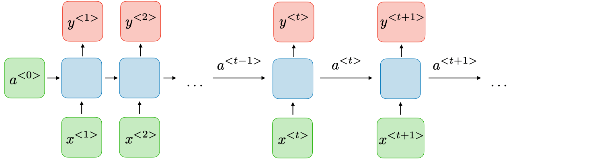

1. **Input Layer**: Accepts the input data at each time step. The input can be a sequence of vectors, where each vector represents a feature at a specific time.

2. **Hidden Layer**: Contains recurrent units that maintain a hidden state. The output from the previous time step is fed back into the network along with the current input, allowing the network to remember information from earlier inputs.

3. **Output Layer**: Produces the final output based on the hidden state. This can vary depending on the task (e.g., classification, prediction).

**Mathematical Representation**

At each time step \( t \):

- The hidden state \( h_t \) is updated using:
\[ a^t = g_1(W_{aa}a^{t-1} + W_{ax}x^t + b_a) \]
  where:
  - **\( a^t \)**: This denotes the hidden state of the RNN at time step \( t \). The hidden state captures information from previous time steps and is used to make predictions. 
  - **\( g_1 \)**: This is the activation function applied to the hidden layer. Common choices for \( g_1 \) include the tanh function or the ReLU function. 
  - **\( W_{aa} \)**: This is the weight matrix that connects the previous hidden state \( a^{t-1} \) to the current hidden state \( a^t \). The weights in this matrix determine how much influence the previous hidden state has on the current one. 
  - **\( a^{t-1} \)**: This represents the hidden state of the RNN at the previous time step \( t-1 \). It contains information from all previous time steps up to \( t-1 \). 
  - **\( W_{ax} \)**: This is the weight matrix that connects the current input \( x^t \) to the hidden state \( a^t \). The weights in this matrix determine how much influence the current input has on the hidden state. 
  - **\( x^t \)**: This denotes the input at time step \( t \). The input could be a word embedding, a feature vector, or any other type of sequential data. 
  - **\( b_a \)**: This is the bias term for the hidden layer. It allows the model to shift the hidden state activation function, providing additional flexibility in fitting the data.

- The output \( y_t \) is computed as: 
  \[ y^t = g_2(W_{ya}a^t + b_y) \]
  where \( W_{ya} \) are the weights from the hidden layer to the output layer, and \( b_y \) is the output bias.

**Key Properties**

- **Shared Weights**: The same weights are used across all time steps, reducing the number of parameters and enabling the model to learn temporal dependencies.
  -  the weights (the numerical values that determine how strongly different parts of the input influence the output) are not unique for each time step. Instead, the same set of weights is used for processing the input at every point in the sequence.
  -  **Why It's Important**:
     -  **Parameter Efficiency**: Imagine processing a sentence with 100 words. If we had separate weights for each word position, we'd need an enormous number of parameters. Weight sharing drastically reduces the parameter count, making the model more computationally manageable.
     -  **Learning Temporal Patterns**: Because the same weights are applied to different parts of the sequence, the RNN can learn general patterns that hold across time. For instance, in language processing, it might learn that the word "the" often precedes a noun.
     -  **Generalization to Different Sequence Lengths**: Weight sharing means the model doesn't care if you feed it a sentence with 10 words or 100 words. It can apply the same learned patterns regardless of the sequence length, making it more flexible and adaptable.

- **Memory**: The hidden state acts as a memory that retains information from previous inputs, allowing the network to consider context when making predictions.
  - **Why It's Important**:
    - **Capturing Dependencies**: Many real-world sequences have dependencies across time. For example, in a sentence, the meaning of a word often depends on the words that came before it. The hidden state enables the RNN to capture these dependencies, allowing it to make more accurate predictions.
    - **Temporal Context**: Consider a time-series analysis task (e.g., predicting stock prices). The current price depends not just on the most recent data point, but also on the trend over the past several days. The hidden state allows the RNN to incorporate this historical context.

**Types of RNNs:**

* **One-to-One:** Vanilla neural network (not truly recurrent).
* **One-to-Many:** Used for image captioning, music generation.
* **Many-to-One:** Used for sentiment analysis, text classification.
* **Many-to-Many:** Used for machine translation, named entity recognition.

**Challenges:**

* **Vanishing Gradients:**  Gradients can shrink exponentially during backpropagation through time, making it difficult to learn long-term dependencies.
  * This happens because the gradients are computed through a chain of multiplications, and if the weights or the derivatives of the activation functions are less than 1, these multiplications can result in exponentially shrinking values.
  * **Impact**: When gradients vanish, the RNN struggles to learn and adjust the weights in the earlier layers of the network. This makes it difficult for the model to capture long-term dependencies in the data.
  * **Solutions**:
    * **Activation Functions**: Using activation functions like ReLU, which have derivatives of 1 for positive values, can mitigate the vanishing gradient problem.
    * **Weight Initialization**: Careful initialization of weights can also help prevent gradients from vanishing too quickly.
    * **Long Short-Term Memory (LSTM) and Gated Recurrent Units (GRU)**: These are specialized RNN architectures that incorporate gates to regulate the flow of information, effectively addressing the vanishing gradient problem.
* **Exploding Gradients:** Gradients can grow exponentially, leading to instability during training.
  * This occurs similarly to the vanishing gradient problem but in the opposite direction—when the weights or the derivatives of the activation functions are greater than 1, the chain of multiplications during backpropagation can lead to exponentially growing values.
  * **Impact**: Large gradients can cause the weight updates to be so large that the model parameters become unstable and the training process diverges. This can result in the model making poor predictions or even causing numerical overflow errors.
  * **Solutions**:
    * **Gradient Clipping**: This technique involves capping the gradient values to a threshold if they exceed a certain magnitude. By clipping the gradients, the training process remains stable.
    * **Weight Regularization**: Adding regularization terms to the loss function can discourage the weights from growing too large, helping to prevent exploding gradients.
    * **Careful Learning Rate Selection**: Using a smaller learning rate can reduce the magnitude of the weight updates, mitigating the risk of exploding gradients.

**Applications:**

* **Natural Language Processing (NLP):** Machine translation, sentiment analysis, text generation.
* **Time Series Analysis:** Stock prediction, anomaly detection.
* **Speech Recognition:** Automatic speech transcription.
* **Machine Translation:** Translating text from one language to another.

**Interview Tips:**

* **Understanding:**  Be able to explain how RNNs differ from feedforward networks and why they are suitable for sequential data.
* **Applications:**  Discuss real-world applications of RNNs and specific examples of how they are used.
* **Challenges:** Be prepared to explain the vanishing/exploding gradient problem and solutions (LSTMs, GRUs, covered below).
* **Coding:**  Be ready to implement a basic RNN cell (forward and backward pass) in Python or a similar language. 

* **Definitions:** Know the key terms (hidden state, parameter sharing, etc.).
* **Architectures:** Understand the different types of RNNs (one-to-one, one-to-many, etc.) and their use cases.
* **Mathematics:** Be familiar with the equations used to calculate the hidden state and output.
* **Challenges & Solutions:**  Be able to explain the vanishing/exploding gradient problem and its solutions.

**Resources of RNNs**
- [Andrej Karpathy's take on RNN](https://karpathy.github.io/2015/05/21/rnn-effectiveness/)
- [Visualization of RNNs](https://distill.pub/2019/memorization-in-rnns/)
- [CS 230 DeepLearning: RNN](https://stanford.edu/~shervine/teaching/cs-230/cheatsheet-recurrent-neural-networks#overview)

### 4. GRU and LSTM
LSTM and GRU, are designed to address the vanishing gradient problem that traditional RNNs face when dealing with long sequences. LSTMs have more gates and are potentially more powerful, but GRUs are simpler and faster to train.

#### GRU vs LSTM: Comparison Table

| **Feature**                       | **GRU (Gated Recurrent Unit)**                    | **LSTM (Long Short-Term Memory)**                        |
|-----------------------------------|--------------------------------------------------|--------------------------------------------------------|
| **Architecture Components**       | Update Gate, Reset Gate                          | Input Gate, Forget Gate, Output Gate, Cell State        |
| **Gating Mechanisms**             | Two gates (Update, Reset)                        | Three gates (Input, Forget, Output)                     |
| **Hidden State**                  | Single hidden state                              | Hidden state and cell state                             |
| **Parameter Efficiency**          | Fewer parameters due to simpler structure        | More parameters due to complex structure                |
| **Computation Efficiency**        | Computationally more efficient                   | Computationally less efficient                          |
| **Complexity**                    | Simpler                                          | More complex                                            |
| **Capability to Capture Long-Term Dependencies** | Moderate                                          | Strong                                                  |
| **Memory Usage**                  | Less memory usage                                | More memory usage                                       |
| **Training Speed**                | Faster training                                  | Slower training                                         |
| **Performance on Small Datasets** | Generally better due to fewer parameters         | May overfit on small datasets                           |
| **Performance on Large Datasets** | Good, but can be outperformed by LSTMs on long sequences | Typically better for large datasets and long sequences |
| **Vanishing Gradient Problem**    | Mitigates the problem                            | Strongly mitigates the problem                          |
| **Exploding Gradient Problem**    | Similar handling to LSTM                         | Similar handling to GRU                                 |
| **Initialization Sensitivity**    | Less sensitive to initialization                 | More sensitive to initialization                        |
| **Gate Equations**                | - **Update Gate**: \( z_t = \sigma(W_z \cdot [h_{t-1}, x_t]) \)   - **Reset Gate**: \( r_t = \sigma(W_r \cdot [h_{t-1}, x_t]) \)   - **New Memory Content**: \( \tilde{h}_t = \tanh(W \cdot [r_t \circ h_{t-1}, x_t]) \)   - **Final Memory**: \( h_t = (1 - z_t) \circ h_{t-1} + z_t \circ \tilde{h}_t \) | - **Input Gate**: \( i_t = \sigma(W_i \cdot [h_{t-1}, x_t] + b_i) \)   - **Forget Gate**: \( f_t = \sigma(W_f \cdot [h_{t-1}, x_t] + b_f) \)   - **Cell State Update**: \( \tilde{C}_t = \tanh(W_C \cdot [h_{t-1}, x_t] + b_C) \)   - **Cell State**: \( C_t = f_t \circ C_{t-1} + i_t \circ \tilde{C}_t \)   - **Output Gate**: \( o_t = \sigma(W_o \cdot [h_{t-1}, x_t] + b_o) \)   - **Hidden State**: \( h_t = o_t \circ \tanh(C_t) \) |
| **Popularity**                    | Increasing, used in simpler and faster applications | Highly popular, used in varied applications requiring long-term memory |
| **Use Cases**                     | Real-time applications, speech recognition, video analysis | Time series prediction, language modeling, machine translation, text generation |
| **Gradient Flow**                 | Easier to backpropagate due to fewer gates       | More robust gradient flow due to cell state and gates   |
| **Activation Functions**          | Sigmoid, Tanh                                    | Sigmoid, Tanh                                           |
| **Advantages**                    | Simplicity, faster training, fewer parameters    | Powerful memory retention, handles long dependencies effectively |
| **Disadvantages**                 | Less expressive due to fewer gates               | More complex, slower training, higher memory usage      |
| **Suitability**                   | Better for problems with simpler temporal dynamics | Better for problems with complex temporal dynamics      |

Lets talk about them one by one.
#### GRU
  - GRUs are a simplified version of LSTMs with fewer gates.
  - They combine the forget and input gates into a single update gate.
  - GRUs are generally faster to train and have fewer parameters than LSTMs, but they may not be as effective in capturing complex dependencies.

#### LSTM
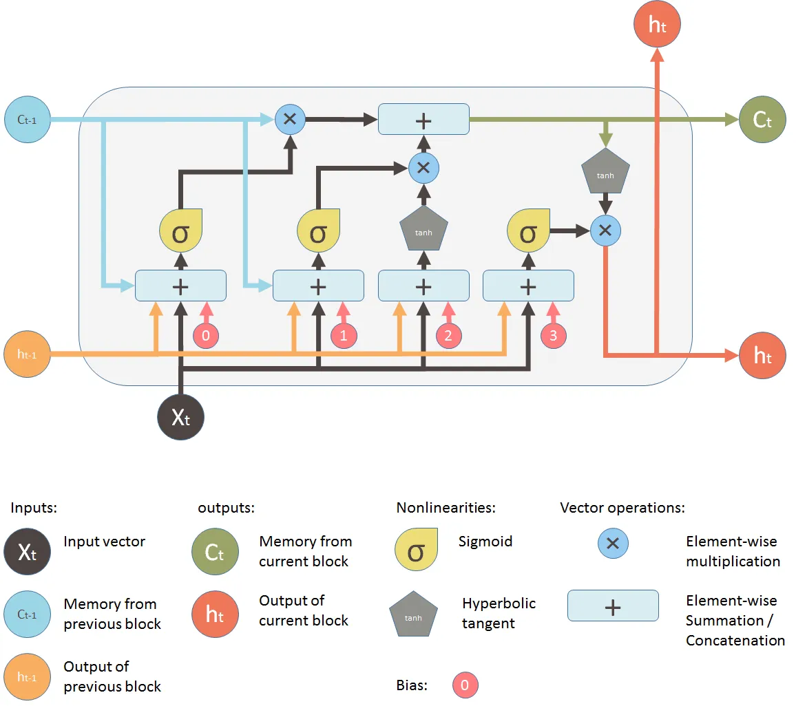
  - [Animation link](https://packaged-media.redd.it/afzlbpt2ncg81/pb/m2-res_720p.mp4?m=DASHPlaylist.mpd&v=1&e=1722204000&s=961305c3c0633ec1c3def4dca2681f828101cc0e#t=0)
  Certainly! Let's delve deeper into the Long Short-Term Memory (LSTM) networks, focusing on their architecture, advantages, disadvantages, and practical applications. This extended version will be suitable for interviews, exams, and in-depth study.

**LSTM Architecture**

- **Main Idea**: LSTMs are designed to address the fundamental challenges of traditional Recurrent Neural Networks (RNNs) by introducing a sophisticated gating mechanism that allows for the selective retention or discarding of information over long sequences. This is achieved through a separate cell state (long-term memory) and a hidden state (short-term memory).

**Components**

* **Cell State (ct):**
  - Acts as a conveyor belt that carries critical information through the sequence with minimal modification.
  - This continuous path enables the LSTM to maintain long-term dependencies without suffering from the vanishing gradient problem.

* **Hidden State (ht):**
  - Represents the network's short-term memory or the current output.
  - Directly influenced by the weights, biases, and the gating mechanisms.

**Gating Mechanisms**
The flow of information into and out of the cell state is meticulously controlled by three gates:

1. **Forget Gate (ft):**
   - Determines what information to discard from the cell state.
   - Calculation: 
     \[
     f_t = \sigma(W_f \cdot [h_{t-1}, x_t] + b_f)
     \]
   - The sigmoid function outputs values between 0 (complete forget) and 1 (complete retain).

2. **Input Gate (it):**
   - Decides what new information to store in the cell state.
   - Calculation:
     \[
     i_t = \sigma(W_i \cdot [h_{t-1}, x_t] + b_i)
     \]
   - Candidate cell state (c̃t):
     \[
     \tilde{c}_t = \tanh(W_c \cdot [h_{t-1}, x_t] + b_c)
     \]
   - Cell state update:
     \[
     c_t = f_t \cdot c_{t-1} + i_t \cdot \tilde{c}_t
     \]

3. **Output Gate (ot):**
   - Determines what parts of the cell state to output.
   - Calculation:
     \[
     o_t = \sigma(W_o \cdot [h_{t-1}, x_t] + b_o)
     \]
   - Hidden state update:
     \[
     h_t = o_t \cdot \tanh(c_t)
     \]

**Activation Functions**
* **Sigmoid (σ):**
  - Squashes values between 0 and 1, ideal for gating mechanisms where the decision to pass or block information is binary.
  - Example: `σ(10) ≈ 0.99995` (almost fully open gate), `σ(-5) ≈ 0.01` (almost closed gate)

* **Tanh:**
  - Squashes values between -1 and 1, often used for the candidate cell state to provide a wide range of potential updates.

**LSTM Advantages & Disadvantages**

**Advantages**
* **Handles Long-Term Dependencies:**
  - The cell state mechanism effectively preserves information over long sequences, solving the vanishing/exploding gradient problem.
* **Flexible Memory:**
  - Can selectively remember and forget information, making it suitable for various tasks such as language modeling, speech recognition, and time series forecasting.
* **State-of-the-Art Performance:**
  - Has been the backbone of many successful Natural Language Processing (NLP) applications and continues to be a benchmark in sequence modeling.

**Disadvantages**
* **Complexity:**
  - The architecture is more complex than traditional RNNs, leading to slower training and potential overfitting.
* **Resource-Intensive:**
  - Requires more computational resources than simpler models, which can be a constraint for real-time applications or on resource-limited devices.

**Practical Applications**
* **Language Modeling:**
  - Predicting the next word in a sentence or generating coherent text.
* **Speech Recognition:**
  - Transcribing spoken words into text.
* **Time Series Forecasting:**
  - Predicting future values based on historical data.
* **Machine Translation:**
  - Translating text from one language to another while maintaining context.

**Interview/Exam Tips**
* **Understanding Gates:**
  - Be prepared to explain the role of each gate and their calculations in detail.
* **LSTM vs. RNN/GRU:**
  - Know the key differences and trade-offs between LSTMs, GRUs, and vanilla RNNs.
* **Applications:**
  - Be familiar with real-world applications of LSTMs in NLP, time series analysis, etc.
* **Mathematical Details:**
  - Understand the equations for each gate and the cell state update.
* **Coding:**
  - Be able to implement a basic LSTM cell in Python or your preferred language.

Resources:
- [LSTM explained step-by-step](https://www.youtube.com/watch?v=YCzL96nL7j0&list=PLblh5JKOoLUIxGDQs4LFFD--41Vzf-ME1&index=16)
- [colah's blog](https://colah.github.io/posts/2015-08-Understanding-LSTMs/)
- [LSTM visualization](https://lstmvis.vizhub.ai/)
- [LSTM Medium Article](https://blog.mlreview.com/understanding-lstm-and-its-diagrams-37e2f46f1714)

---
### 5. Transformers

#### Transformer Architecture

**Core Concepts:**

* **Parallel Processing:** Unlike recurrent neural networks (RNNs take data sequentially so they cannot utilize the GPUs efficiently), Transformers process input sequences in parallel, making them computationally efficient.
* **Attention Mechanism:** This is the heart of Transformers. It allows the model to weigh the importance of different words in relation to each other, dynamically during processing.
* **Positional Encoding:** Since the model processes words simultaneously, positional information is explicitly added to the input to preserve word order.

**Transfomer Architecture:** Has Encoder and Decoder. The encoder takes in our input and outputs a matrix representation of that input. The decoder takes in that encoded representation and iteratively generates an output. However, both the encoder and the decoder are actually a stack with multiple layers (same number for each). All encoders present the same structure, and the input gets into each of them and is passed to the next one. All decoders present the same structure as well and get the input from the last encoder and the previous decoder.
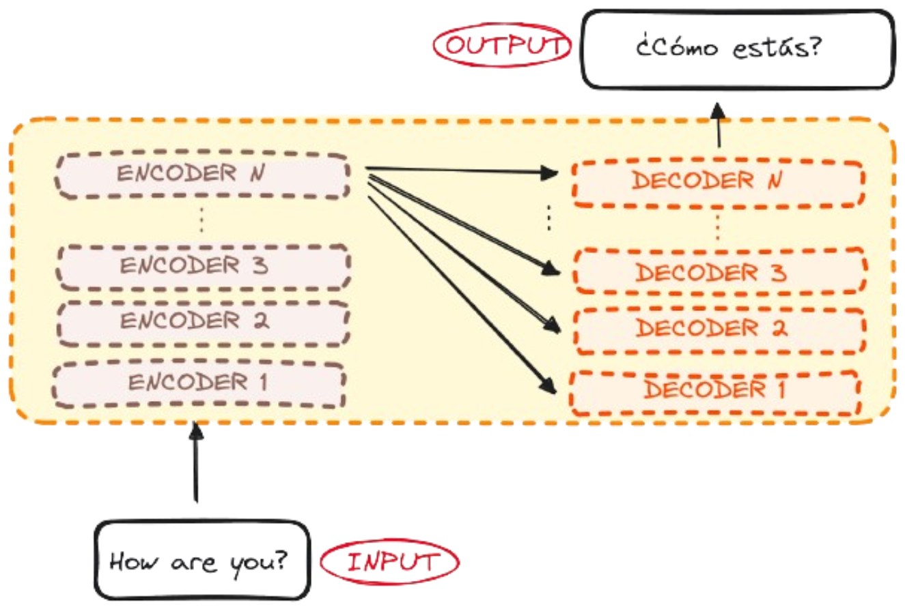
The original architecture consisted of 6 encoders and 6 decoders, but we can replicate as many layers as we want. So let’s assume N layers of each.

#### Encoder: 
   Unlike earlier models that processed tokens independently, the Transformer encoder captures the context of each token with respect to the entire sequence.
   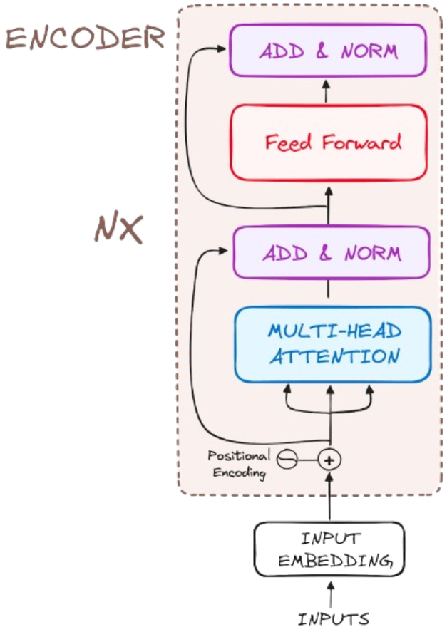

   **1. Input Embeddings (Encoder Only)**
   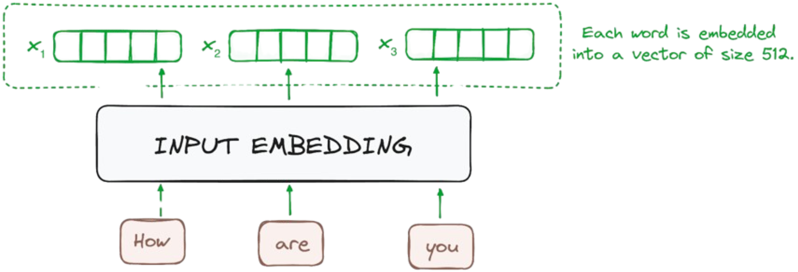
   * **Tokens:** The input text is divided into smaller units called tokens (words or subwords).
   * **Embedding Layer:**  Each token is converted into a numerical vector (embedding) that represents its meaning in a high-dimensional space.
   * **Encoder Input:** The bottom-most encoder receives these word embeddings. Other encoders receive the output from the encoder below.

   **2. Positional Encoding (Encoder and Decoder)**
   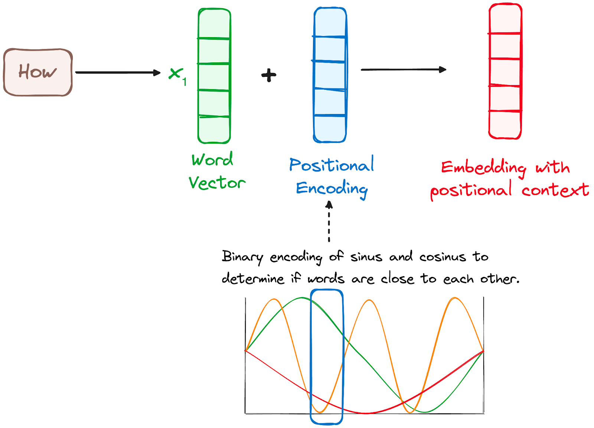

   * **Problem:** Transformers lack inherent word order information.
   * **Solution:** Positional encodings are added to the input embeddings.
   * **How:** Sine and cosine functions with different frequencies are used to create a unique vector for each position in the sequence.

   **3. Encoder Layers (Repeated Stack)**
   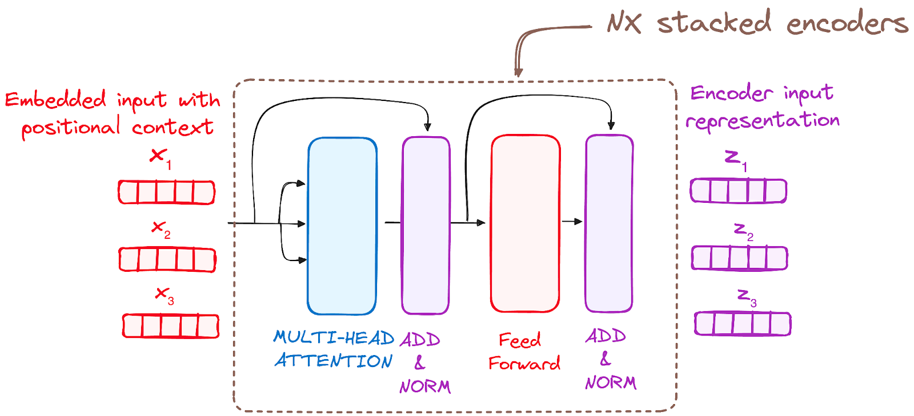

   * **Purpose:**  Transform the input sequence into a meaningful representation.
   * **Components:**
      * **Multi-Head Self-Attention:** Captures relationships between words in the input sequence.
      * **Feedforward Network:** Applies non-linear transformations to refine the representation.
      * **Residual Connections:** Add the original input to the output to prevent vanishing gradients.
      * **Layer Normalization:** Normalizes the output for stability and faster training.

   **3.1 Multi-Head Self-Attention**
    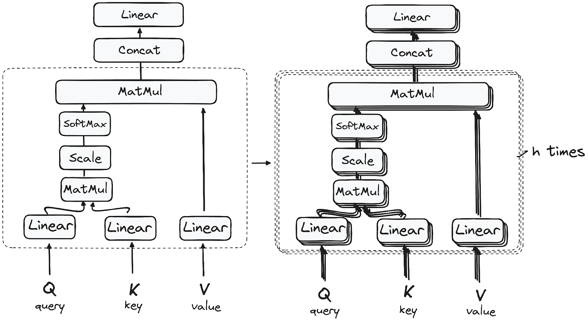
   * **Goal:**  Allows the model to weigh the importance of different words in the sequence when processing a specific word.
   * **Steps:**
      1. **Query, Key, Value Matrices:**  Each input embedding is transformed into three separate vectors: query, key, and value.
      2. **Attention Scores:** Calculated by comparing the query vector of a word with the key vectors of all other words (using dot product).
      3. **Scaling:** Attention scores are scaled down to prevent unstable gradients.
      4. **Softmax:** Converts the scaled scores into probabilities, representing the attention weights for each word.
      5. **Weighted Sum:** The value vectors are multiplied by the attention weights and summed up to get the attention output.
   * **Multi-Head:**  This process is repeated multiple times with different linear transformations to capture diverse relationships between words.

   **3.2 Normalization and Residual Connections**
       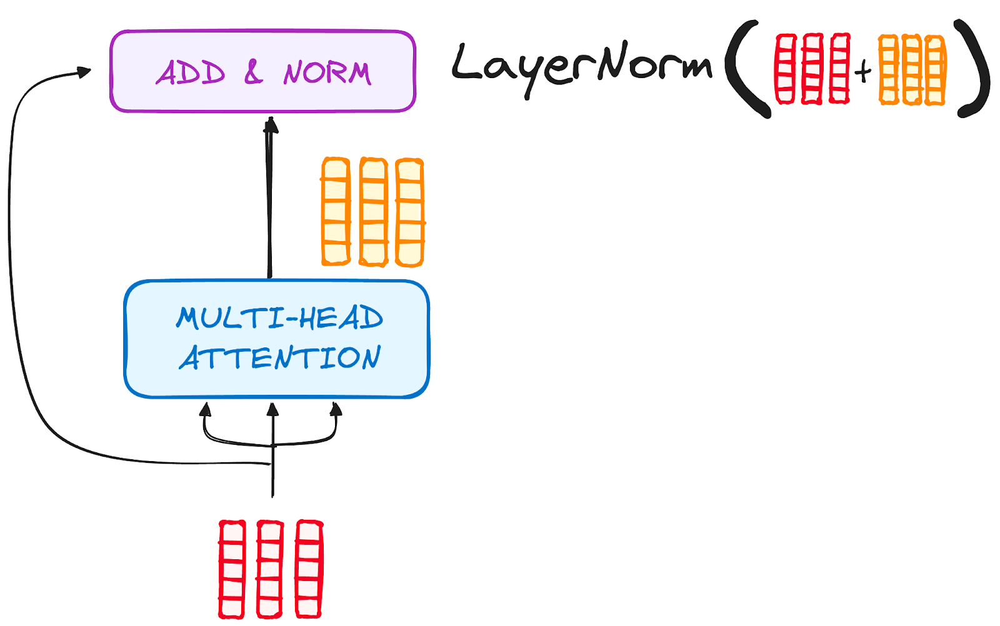
   * **Normalization:** Layer normalization is applied after the multi-head attention mechanism.
   * **Residual Connection:** The original input embedding is added to the normalized output.

   **3.3 Feedforward Network**
       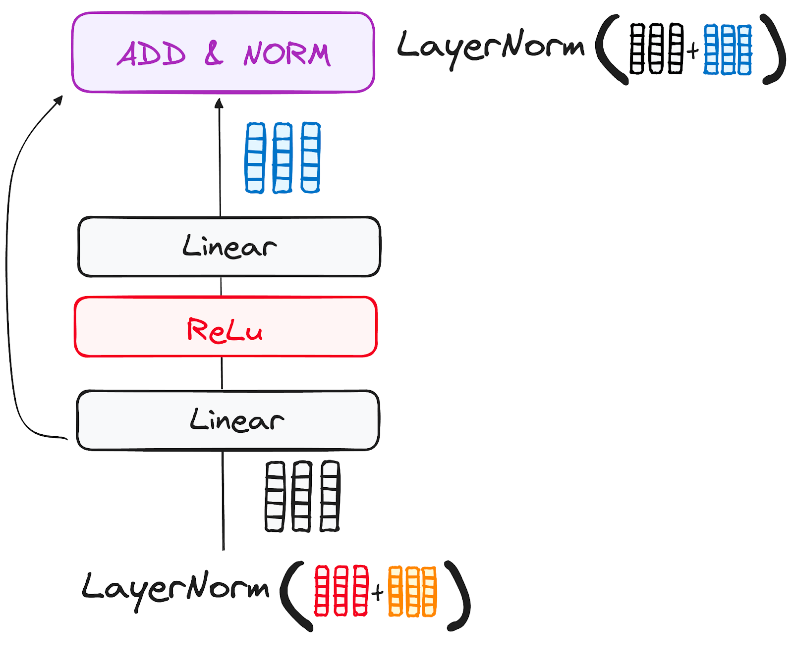
   * **Structure:** Two linear layers with a ReLU activation function in between.
   * **Purpose:** Further refines the representation learned by the self-attention layer.
   * **Normalization and Residual Connection:**  Applied again after the feedforward network.
  
   **STEP 4 - Output of the Encoder**
   - The final encoder layer produces a set of vectors, one for each input token.
   - These vectors are enriched with contextual information about the entire input sequence.
   - They serve as input to the decoder, guiding its attention towards relevant parts of the input.
Absolutely! Let's condense and refine those steps into concise study notes for the Transformer decoder:

#### Decoder
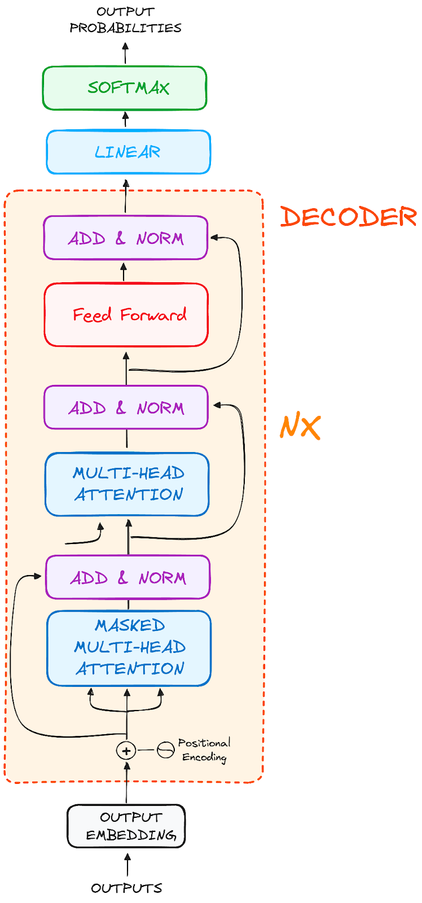

**1. Output Embeddings:**

* **Input:** Starts with a special "start" token.
* **Embedding Layer:** Converts each token (start token and previously generated tokens) into a numerical vector.

**2. Positional Encoding:**

* **Adds Positional Information:**  Similar to the encoder, positional encodings are added to the input embeddings.
* These positional embeddings are then channeled into the first multi-head attention layer of the decoder, where the attention scores specific to the decoder’s input are meticulously computed.

**3. Decoder Layers (Repeated Stack)**

* **Purpose:**  Generate the output sequence token by token. It has 3 sub-components
* **Components:**
    * **Masked Self-Attention:**  Focuses on the current and previous tokens, preventing the model from peeking at future tokens.
     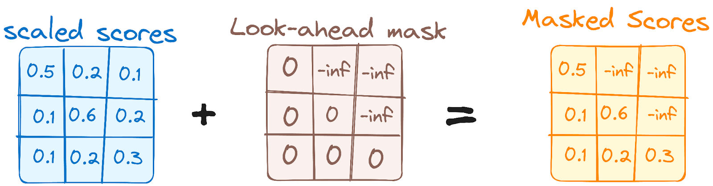
    * **Encoder-Decoder Multi-Head Attention or Cross Attention:**  Incorporates information from the encoder's context vectors, aligning the decoder's focus with relevant parts of the input sequence.
      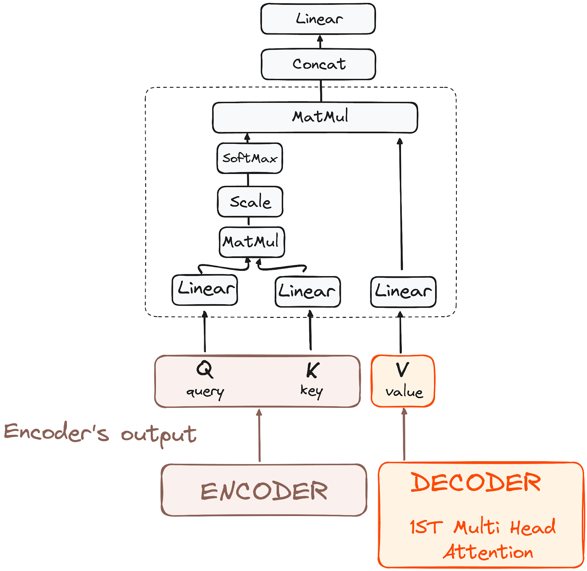
    * **Feedforward Network:** Further refines the representation. Similar to the encoder, each decoder layer includes a fully connected feed-forward network, applied to each position separately and identically.
   
   **Residual Connections and Layer Normalization:** Applied after each sub-layer for stability and training efficiency.

**4. Linear Classifier and Softmax:**
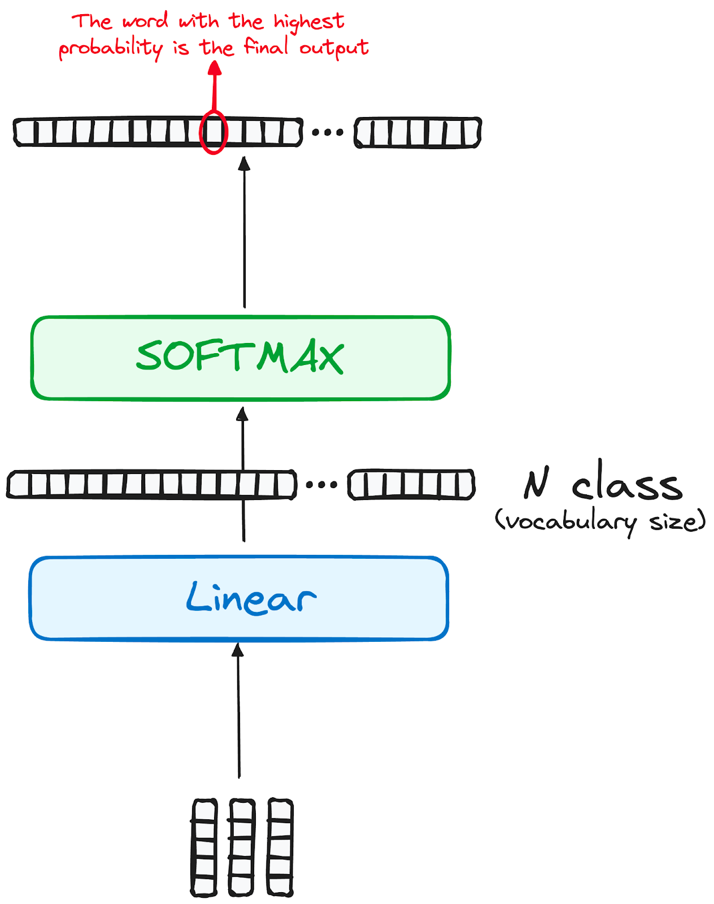
* **Linear Layer:** Produces logits (raw scores) for each word in the vocabulary.
* **Softmax:**  Converts the logits into probabilities, selecting the most likely next token.

**Key Points:**

* **Autoregressive Decoding:** The decoder generates the output sequence step by step, using its previous predictions as additional input.
* **Masked Self-Attention:** Prevents the decoder from cheating by looking at future tokens.
* **Encoder-Decoder Attention:**  Allows the decoder to focus on the most relevant parts of the input.

**Interview/Exam Tips:**

* **Autoregressive Nature:** Be able to explain the step-by-step generation process of the decoder.
* **Masking:** Understand the importance of the masked self-attention mechanism in preventing information leakage.
* **Attention in Decoder:** Be able to differentiate between the two attention mechanisms in the decoder (masked self-attention vs. encoder-decoder attention) and their roles.
* **Token Generation:** Explain how the linear layer and softmax function are used to produce the final output sequence.

---
   - **Multi-Head Self-Attention**: 
     - **Self-Attention Calculation**: Each token attends to every other token in the sequence to weigh their importance.
       - **Query, Key, Value Vectors**: For each token, three vectors (query, key, and value) are computed using learned weight matrices.
       - **Attention Scores**: The attention score for a token is computed as the dot product of the query vector with the key vectors of all tokens, followed by a softmax operation to get the attention weights.
       - **Weighted Sum**: Each token's output is a weighted sum of the value vectors, weighted by the attention scores.
     - **Multi-Head Mechanism**: Multiple self-attention mechanisms (heads) are run in parallel to capture different aspects of the relationships between tokens.
     - **Concatenation and Linear Transformation**: The outputs of the multiple heads are concatenated and passed through a linear transformation.

   - **Feed-Forward Neural Network**: After the self-attention layer, the output is passed through a feed-forward neural network (FFN), which consists of two linear transformations with a ReLU activation in between.

   - **Add & Norm**: Residual connections and layer normalization are applied after both the self-attention and feed-forward layers to stabilize and improve the training process.

    **Decoder**: 
      - Similar to the encoder but with an additional layer of multi-head attention over the encoder’s output to incorporate the encoded input context into the generation process.

**Word Embedding and Tokenization**

* **Word Embeddings:**  
    - These are dense vector representations of words that capture semantic relationships.
    - Methods: Word2Vec, GloVe, FastText, or learned directly by the Transformer.
    - Subword tokenization (e.g., Byte Pair Encoding) is often used to handle rare words and out-of-vocabulary tokens.
* **Tokenization:**
    - The process of breaking down text into smaller units (words, subwords, or characters).
    - This is crucial for feeding input into the Transformer.

**Self-Attention Mechanism**

* **Purpose:** The self-attention mechanism lets the Transformer model focus on different parts of the input sequence when generating a specific part of the output.
* **Steps:**
    1. **Query, Key, Value Matrices:** Each word is transformed into three vectors: query, key, and value.
    2. **Attention Scores:** The similarity between the query vector of a word and the key vectors of all other words is calculated (usually using dot product).
    3. **Scaling:** Attention scores are scaled down to avoid large values that could lead to unstable gradients.
    4. **Softmax:**  A softmax function converts the scaled scores into a probability distribution, where each word is assigned a weight indicating its importance.
    5. **Weighted Sum:** The value vectors of all words are multiplied by their corresponding weights and summed up to get the attention output for that word.

* **Multi-Head Attention:** Multiple self-attention layers are stacked in parallel to capture different aspects of the input sequence, improving the model's expressive power.

**Positional Encoding**

* **Necessity:** Since Transformers don't have inherent positional awareness, positional encoding adds information about the position of each word in the sequence.
* **Implementation:**  Typically, sinusoidal functions (sine and cosine) with different frequencies are used to encode position. This provides a continuous and smooth representation of position.

**Encoder-Decoder Architecture**

* **Encoder:** 
    - Takes the input sequence and processes it through multiple layers of self-attention and feedforward networks.
    - The final output of the encoder is a set of context vectors that represent the encoded information of the input sequence.

* **Decoder:** 
    - Takes the context vectors from the encoder and generates the output sequence token by token.
    - It uses self-attention to focus on the relevant parts of the input and previously generated output.
    - It also uses encoder-decoder attention to attend to the context vectors from the encoder.

**Residual Connections and Layer Normalization**

* **Residual Connections:** Add the original input to the output of each layer. This helps mitigate the vanishing gradient problem and allows for deeper networks.
* **Layer Normalization:**  Normalizes the outputs of each layer to stabilize training and speed up convergence.

**Additional Considerations**

* **Variations:** Many variations of the Transformer architecture exist, such as the BERT (Bidirectional Encoder Representations from Transformers) model, which is widely used for natural language understanding tasks.
* **Training:** Transformers are often pre-trained on massive amounts of text data using unsupervised learning and then fine-tuned for specific tasks.

**Interview/Exam Tips**

* **Deep Understanding:** Be prepared to explain the attention mechanism and its role in capturing dependencies in detail.
* **Strengths and Weaknesses:** Understand the advantages (parallel processing, handling long-term dependencies) and limitations (computational cost for long sequences) of Transformers.
* **Applications:** Know the wide range of applications (translation, text generation, sentiment analysis, etc.) and be able to provide examples.
* **Variations:** Be aware of major variations of the Transformer architecture and their use cases.

---

4. **Output Generation**
- In tasks like machine translation or text generation, the decoder generates the output sequence one token at a time, using previously generated tokens as input, until an end-of-sequence token is produced.

1. **Training**
- **Loss Function**: The model is trained to minimize the difference between the predicted output and the actual target output using a loss function like cross-entropy loss.
- **Optimization**: Parameters are updated using an optimization algorithm like Adam to minimize the loss.
  
---
### BERT

**BERT: Overview and Key Concepts**
1. Introduction:
   - Developed by Google in 2018, State-of-the-art language representation model
   - Pre-trained on large corpus of unlabeled text

2. Key Innovations:
   - Bidirectional context understanding
     - understands the meaning of a word by looking at the words both before and after it in a sentence, giving it a broader understanding of the context.
   - Masked Language Model (MLM) pre-training
     - plays a fill-in-the-blank game, learning to predict missing words based on the surrounding context. This helps it learn the relationships between words.
   - Next Sentence Prediction (NSP) task

3. Architecture:
   - Based on the Transformer encoder architecture
   - Available in two sizes:
     * BERT-Base: 12 layers, 768 hidden units, 12 attention heads
     * BERT-Large: 24 layers, 1024 hidden units, 16 attention heads

**Working of BERT**

1. Input Representation:
   - TokenType IDs: Segment embeddings to distinguish between sentence pairs
   - Position IDs: Positional embeddings to capture token positions
   - Input IDs: WordPiece token IDs

2. Pre-training Tasks:
   a. Masked Language Model (MLM):
      - Randomly mask 15% of input tokens
      - Predict the masked tokens
      - Encourages bidirectional context understanding

   b. Next Sentence Prediction (NSP):
      - Binary classification task
      - Predict if sentence B follows sentence A
      - Helps in understanding sentence relationships

3. Fine-tuning:
   - Adapt pre-trained BERT to specific downstream tasks
   - Add task-specific layers on top of BERT
   - Fine-tune entire model end-to-end

4. Attention Mechanism:
   - Multi-head self-attention
   - Allows each token to attend to all other tokens in the sequence

5. Contextual Embeddings:
   - Produces context-dependent representations for each token
   - Captures word sense disambiguation and polysemy

**Important BERT Variants**
1. RoBERTa:
   - Optimized training procedure
   - Larger batch sizes and more training data
   - Removes NSP task

2. DistilBERT:
   - Smaller, faster version of BERT
   - 40% smaller, 60% faster, retains 97% of BERT's performance

3. ALBERT:
   - Parameter-efficient version of BERT
   - Cross-layer parameter sharing
   - Factorized embedding parameterization

4. ELECTRA:
   - More efficient pre-training
   - Replaced Token Detection instead of MLM

5. BERT-wwm (Whole Word Masking):
   - Masks whole words instead of WordPiece tokens
   - Improves performance on certain tasks

**Applications of BERT**
Text Classification, Named Entity Recognition (NER), Question Answering, Sentiment Analysis, Text Summarization, Machine Translation

**BERT's Impact and Limitations**

1. Impact:
   - Set new state-of-the-art results on many NLP tasks
   - Sparked development of numerous transformer-based models

2. Limitations:
   - Maximum sequence length of 512 tokens
   - Computationally expensive
   - Struggle with out-of-domain text
   - Bias in pre-training data can lead to biased model outputs

**Advanced Concepts**

1. Attention Visualizations:
   - Interpret BERT's attention patterns
   - Insights into model's focus and decision-making

2. Probing Tasks:
   - Analyze what linguistic knowledge BERT captures
   - Investigate syntactic and semantic understanding

3. Domain-Specific BERT:
   - Pre-train BERT on domain-specific corpora (e.g., BioBERT for biomedical text)

4. Multilingual BERT:
   - Single BERT model trained on 104 languages
   - Zero-shot cross-lingual transfer capabilities

5. BERT for Information Retrieval:
   - Dense passage retrieval
   - Semantic search applications

**Best Practices for Using BERT**

1. Choose appropriate model size based on task and computational resources
2. Use dynamic padding and attention masking for efficient batching
3. Implement gradient accumulation for larger effective batch sizes
4. Use learning rate warmup and decay during fine-tuning
5. Experiment with different fine-tuning strategies (e.g., layer freezing)

**How to work on word level and sentence level tasks?**
1. **Word-Level Tasks (e.g., Named Entity Recognition):**

   1. Classification Layer:
      - Purpose: Predicts the entity type (e.g., person, organization, location) for each token in the input sentence.
      - Implementation: A linear layer is added on top of BERT's output for each token position. This layer outputs a probability distribution over all possible entity types.

   2. Training Data:
      - Format:  Each word in the dataset is labeled with its corresponding entity type. 
      - Example: "John Smith works at Google." would be labeled as "John Smith (PERSON), works (O), at (O), Google (ORGANIZATION)."
      - Objective: During fine-tuning, BERT learns to associate the token representations with their respective entity types based on the labeled data.

2. **Sentence-Level Tasks (e.g., Sentiment Analysis):**

   1. Pooling:
      - Purpose: Aggregates token-level embeddings from BERT's output into a single vector representing the entire sentence.
      - Strategies:
         - Mean Pooling: Averages the embeddings of all tokens in the sentence.
         - Max Pooling: Takes the maximum value for each dimension across all tokens.
         - [CLS] Token Embedding: Uses the embedding of the special classification token ([CLS]) added at the beginning of the sentence, as it often captures sentence-level information.

   2. Classification Layer:
      - Purpose: Predicts the overall sentiment or label for the entire sentence.
      - Implementation: A linear layer is added on top of the sentence-level embedding. This layer outputs a probability distribution over the possible labels (e.g., positive, negative, neutral).

   3. Training Data:
      - Format: Each sentence in the dataset is labeled with its corresponding sentiment or label.
      - Example: "I love this movie!" would be labeled as "positive."
      - Objective: BERT learns to map sentence-level representations to their corresponding labels based on the training data.

3. Key Considerations:

   * Loss Function: Typically, cross-entropy loss is used for classification tasks.
   * Optimization: Adam optimizer is often employed for fine-tuning.
   * Hyperparameters: Experiment with learning rate, batch size, and the number of epochs to optimize performance.
   * Libraries: Hugging Face Transformers simplifies the fine-tuning process by providing pre-trained BERT models and easy-to-use APIs.

---

