# Chapter 1: Statistical Learning Methods

## 1.1 Introduction to Regression Models
* Models allow us to understand the relationship between Y and X, and identify which predictors are important in explaining Y.
* The ideal or optimal model f(X) is the conditional expectation E(Y|X), which minimizes the average prediction error. This is called the regression function.
* In practice, we estimate f(X) from data using methods like local averaging/nearest neighbors: averaging the Y values for observations whose X values are in a neighborhood around the target X.
* This neighborhood averaging approach works well for estimating f(X) in low dimensions, but can fail in high dimensions when data becomes sparse.
* The prediction error can be decomposed into the irreducible error (variance of Y|X) and the reducible error depending on how well f(X) is estimated.
* Improving the model means reducing the reducible error component by better estimating f(X).

## 1.2 Dimensionality and Structured Models
Here we discuss the situations where the nearest neighbor averaging method for estimating the regression function f(X) = E(Y|X) does not work well, particularly when the number of predictors (p) is large. This is known as the ***curse of dimensionality***.

The issue is that in high dimensions, the nearest neighbors tend to be far away from the target point X, violating the locality principle of local averaging to estimate the conditional expectation. As dimensions increase, we need to expand the neighborhood radius greatly to capture a reasonable fraction of data points, making it no longer a "local" average.

To overcome this, the we use structured/parametric models like **linear regression**: 
* f(X) = b0 + b1X1 + ... + bpXp. 
* These have a fixed number of parameters independent of the data, avoiding the curse of dimensionality. 
* Linear models provide a reasonable approximation to the true f(X), though rarely exactly correct.

More flexible models like polynomial regression (adding X^2, X^3 terms) and non-parametric methods like smoothing splines can also be used. These can better capture non-linear patterns in f(X) compared to linear models.

However, adding flexibility raises other tradeoffs:

**Interpretability vs accuracy:**
* Simple linear models are more interpretable but may underfit complex relationships. More flexible models like splines fit better but are black-box-like.
  
**Overfitting vs underfitting:**
* Very flexible models can overfit the training data by modeling the noise, while inflexible models can underfit.
  
There are a variety of methods (linear models, generalized additive models, tree-based methods, support vector machines etc.) that will be covered to help navigate these tradeoffs when the simple approaches fail.

The key is developing principled ways to select the appropriate model complexity/flexibility to achieve good prediction accuracy without overfitting the training data. This model selection problem will be addressed in subsequent segments.

## 1.3  Model Selection & Bias-Variance Tradeoff
Here we will discuss how to assess the accuracy of different statistical models and choose the appropriate level of model complexity/flexibility. We introduce the concepts of 
* training error, 
* test error, 
* bias-variance tradeoff, and 
* model selection.

**Assessing Model Accuracy:**
* **Training error** (mean squared error on training data) is not a good measure as it can lead to overfitting. Flexible models can perfectly fit the training data but fail to generalize.
* **Test error** (mean squared error on a fresh test dataset) is a better measure of a model's generalization ability.
* **Bias-Variance Tradeoff:**
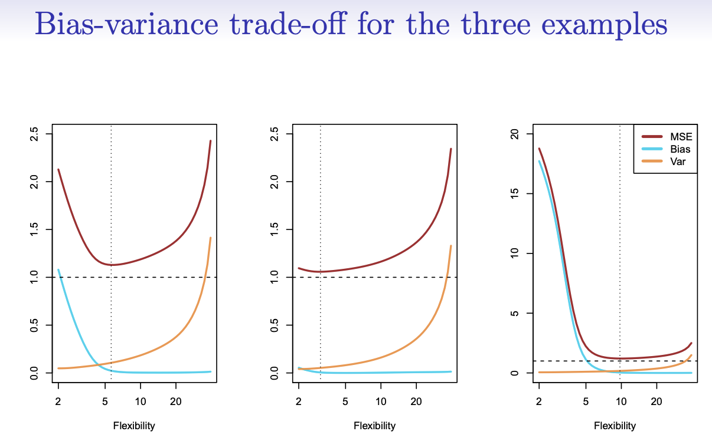
The expected prediction error can be decomposed into: 
  * Irreducible error (variance of data) + Reducible error (bias + variance of model)
  * As model flexibility increases, the bias decreases (model can fit more complex patterns) but the variance increases (model overfits noise in training data).
  * Choosing the right flexibility involves trading off bias and variance to minimize the overall test error.
* **Model Selection:**
  * The goal is to select the model complexity that minimizes the test error, navigating the bias-variance tradeoff.
  * This can be done by evaluating different models on a separate test/validation dataset and picking the one with lowest test error.
  * The course showed examples where linear models underfit (high bias), very flexible models overfit (high variance), and models of intermediate flexibility achieve the best bias-variance tradeoff minimizing test error.

The key challenge is objectively estimating the test error curve to find the sweet spot of flexibility that balances underfitting and overfitting.

## 1.4 Classification
Lets shift our focus to classification problems, where the goal is to build a classifier c(x) that assigns a class label (e.g. spam/ham, digit 0-9) to new observations x based on their feature vector x.

* **Optimal Classifier (Bayes Classifier)**
  *   For a classification problem with K classes, the optimal Bayes classifier assigns the class with the highest conditional probability for a given x:
      *   P(Y=k|X=x)
  *   These conditional probabilities P(Y=k|X=x) completely characterize the distribution of Y|X and define the optimal Bayes decision boundaries separating the classes.

* **K-Nearest Neighbors (KNN) Classifier**
  * KNN approximates the conditional probabilities locally by: 
    * Finding the K nearest points to the target x
    * Estimating P(Y=k|X=x) as the fraction of points in class k
  * It classifies to the class with highest estimated probability
  * KNN suffers from curse of dimensionality like regression problems
  
* **Evaluating Classifiers**
  * Classifier performance is measured by the misclassification error rate (fraction of mistakes made) on test data
  * The Bayes classifier has the lowest possible misclassification rate

 **Tuning the KNN Classifier**
 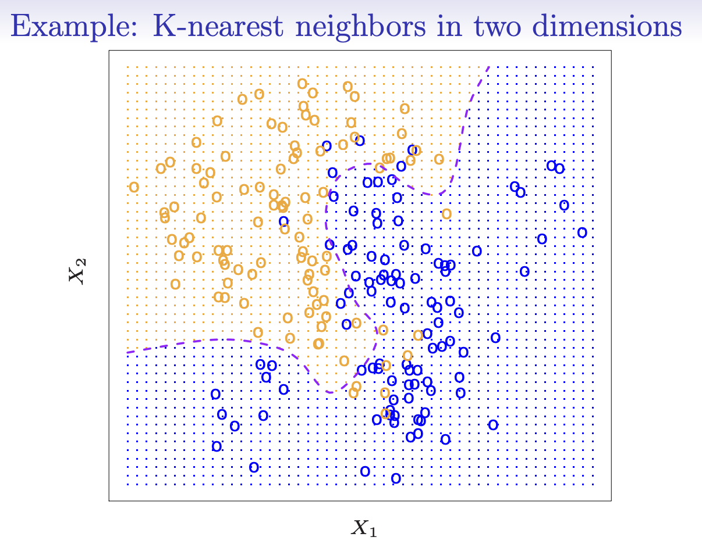

  * The choice of K is a tuning parameter that controls model complexity
  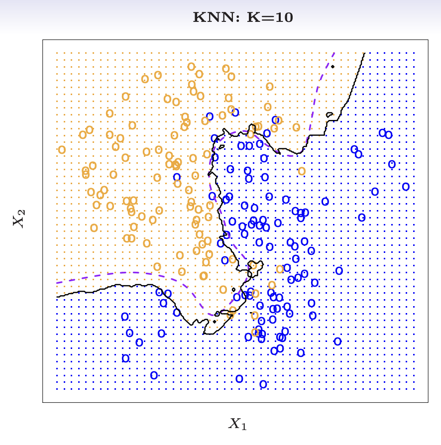
  * Small K (e.g. K=1) leads to very flexible decision boundaries that can overfit
  * Large K gives smoother boundaries but may not capture complex shapes
  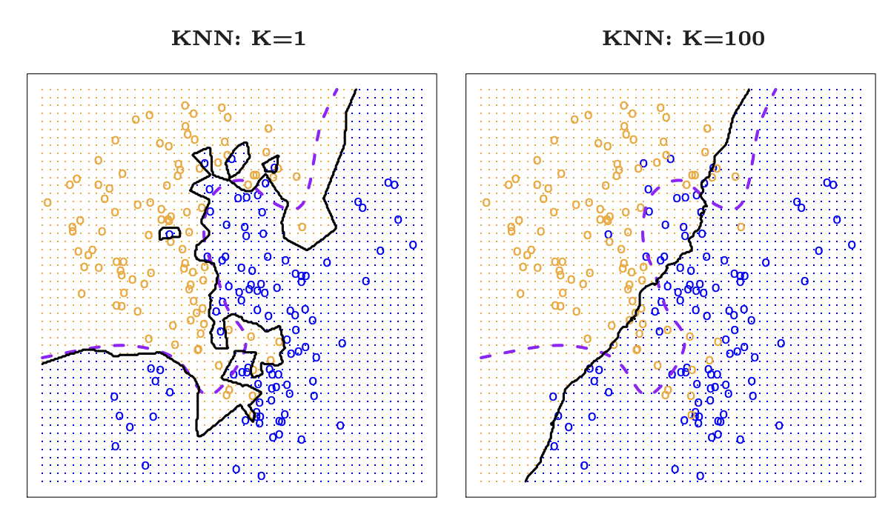
  * K should be chosen to minimize test error, navigating the bias-variance tradeoff
  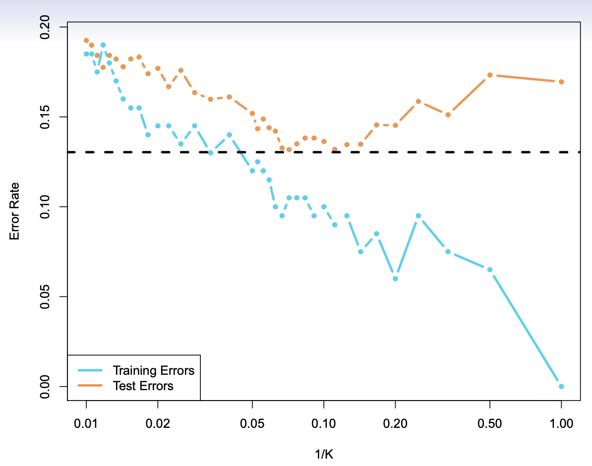
  * We can see 2D examples visualizing KNN decision boundaries for different K values. It highlights the need to select an appropriate K that achieves a good bias-variance trade-off on test data.

Other Classification Methods that can be used for classification are:
* support vector machines, 
* logistic regression, 
* linear discriminant analysis, that will be covered later. 
  
These build structured probability models P(Y=k|X) rather than relying on local averaging like KNN. Modeling probabilities is harder in high dimensions.

So we learnt that, the optimal Bayes classifier motivates classification methods to estimate conditional class probabilities from data. KNN provides a simple local approach, but structured models are needed for high dimensions while controlling model complexity.

# 2. Linear Regression
## 2.1 Simple Linear Regression

* Simple linear regression is a type of supervised learning method used to model the relationship between a dependent variable (Y) and one independent variable (X). It assumes that this relationship is linear.
  * The model equation is represented as: 
        *Y = β0 + β1X1 + β2X2 + ... + βpXp + ε*
  * The coefficients β0 (intercept) and β1, β2, etc. (slopes) are estimated from the data to find the line that best fits the observed points. This is achieved by minimizing the residual sum of squares, which is the sum of squared differences between the observed Y and the predicted Y values.
* Standard errors and confidence intervals are calculated to assess the accuracy of the coefficient estimates.
    * Standard errors measure the precision of these estimates.
    * Confidence intervals indicate the range of values within which the true value of the slope or intercept is likely to fall, with a certain level of confidence (e.g., 95%).
* The objective is to identify the line that minimizes the residual sum of squares, representing the squared differences between the actual outcomes and the predicted outcomes.
* Least squares estimates are used to determine the slope and intercept.
* Limitations of the linear model include its assumption of linearity, which may not hold true for all datasets. Despite this, a linear model can still provide a useful approximation.

## 2.2 Hypothesis Testing and Confidence Intervals
#### Hypothesis Testing

* **Purpose:** Hypothesis testing is employed to determine whether the coefficient of a predictor variable (e.g., slope β1) is zero, indicating no association between X and Y.
    * **Null Hypothesis (H0):** β1 = 0 (no association)
    * **Alternative Hypothesis (Ha):** β1 ≠ 0 (association exists)
* **Test Statistic:**
    * 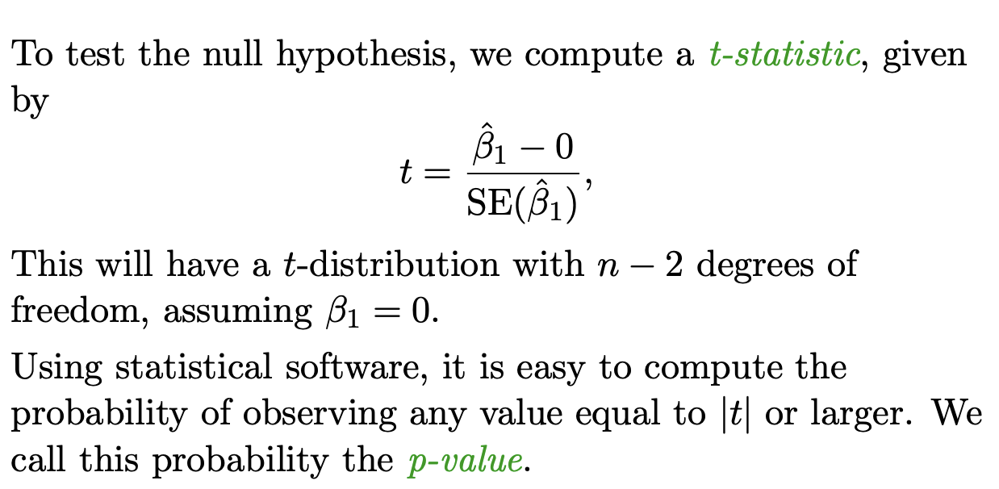
    * Follows a t-distribution with n-2 degrees of freedom under H0.
* A small p-value (e.g., < 0.05) indicates rejection of H0, suggesting that X is a significant predictor.

#### Interpreting Results

* **Failing to Reject H0:**
    * Confidence interval for β1 contains 0.
* **Rejecting H0:**
    * Confidence interval for β1 does not contain 0.
* **Confidence Interval:** Provides a range of plausible values for the effect size of β1.

#### Assessing Overall Model Fit
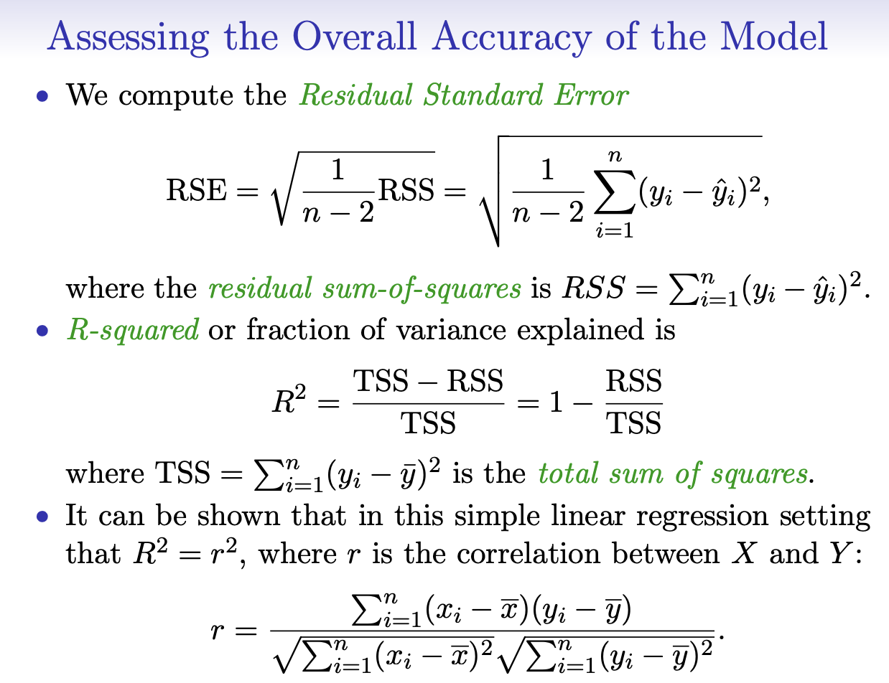
* **Residual Sum of Squares (RSS):** 
    * Represents the minimized objective.
* **Mean Squared Error (MSE):**
    * Estimates the variance around the regression line.
* **R-squared (R^2):** 
    * Indicates the fraction of variance explained by the model, ranging from 0 to 1 (higher is better).
    * Equivalent to the squared correlation between Y and Y_hat.

#### Additional Notes

* Hypothesis tests and confidence intervals serve as equivalent methods for assessing significance.
* Context matters; in certain fields like medicine, an R^2 of 0.05 may be deemed good.
* The next step involves expanding to multiple predictor variables (multiple regression).

## 2.3 Multiple Linear Regression

#### Introduction to Multiple Linear Regression- 
**Multiple Linear Regression:**
  * Allows the use of more than one predictor variable to forecast an outcome.
  * The model comprises an intercept term and a slope coefficient for each predictor variable.

- **Interpreting Regression Coefficients:**
    - Interpretation becomes challenging when predictors are correlated.
    - Coefficient signifies the change in y for a unit change in xj, assuming all other predictors remain constant, which may not accurately reflect real-world scenarios due to correlated predictors.
    - Causal claims should be avoided when predictors are correlated in observational data.

- **Least Squares Estimation:**
    - Least squares estimates minimize the sum of squared deviations between data points and the regression plane/hyperplane.
    - Estimates are typically computed by software, not manually.

- **Key Considerations:**
    - Coefficients are interpreted with the assumption that other predictors are included in the model.
    - Correlated predictors complicate the interpretation and separation of coefficients.
    - Despite being approximations, models can still be useful.
    - Causation cannot be established solely with observational data; active experimentation is necessary.

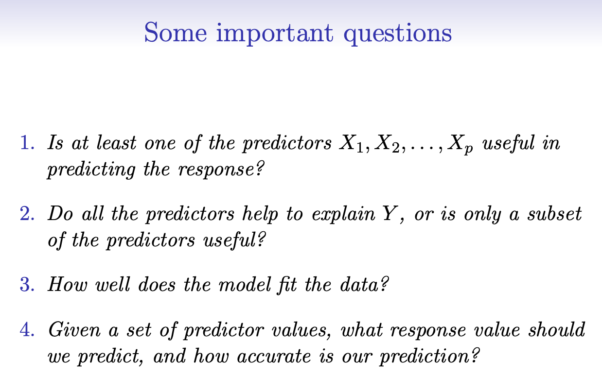
**1. Assessing Predictor Importance:**
  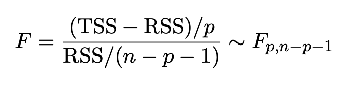
- Evaluate drop in training error (variance reduction) with additional predictors.
- Utilize F-statistic to gauge overall significance of predictors.

**2. Selecting Important Variables:**
- **All Subsets Regression:** Considers all variable combinations, selects based on criterion.
- **Forward Selection:** Starts with no predictors, adds based on fit improvement.
  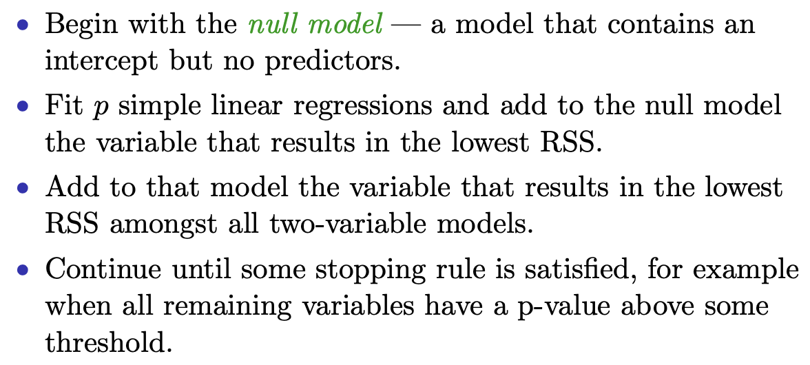
- **Backward Selection:** Starts with all predictors, removes based on minimal fit impact.
  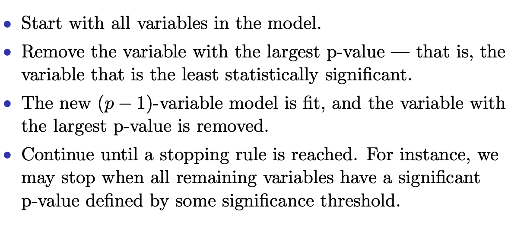

**3. Model selection to get best fit**
- Sophisticated criteria metioned below exist for optimal model complexity:
    * Mallow’s Cp, 
    * Akaike information criterion (AIC), 
    * Bayesian information criterion (BIC), 
    * Adjusted R2
    * Cross-validation (CV).

**Dealing with Categorical Variables:**
- Create dummy variables for categories (except baseline).
- Coefficients of dummy variables reflect outcome differences from baseline.
  
#### Assessing the Regression Model:

- Check usefulness of predictors via drop in training error and F-statistic.
- Identify important predictors using all subsets regression or stepwise methods.
- Assess model fit through adjusted R-squared, cross-validation, etc.

#### Qualitative/Categorical Predictors:
- Create dummy/indicator variables for categories.
- For k categories, create k-1 dummy variables.
- Coefficients reflect difference from baseline category.

